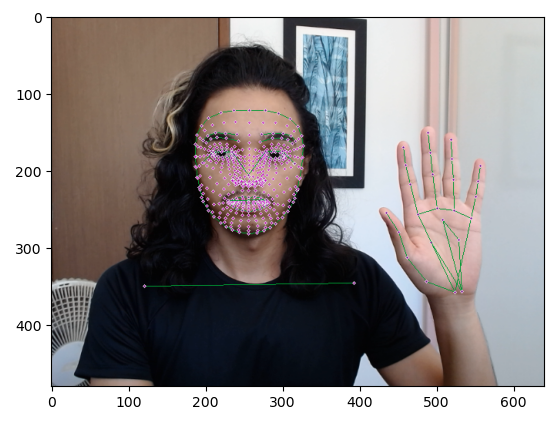
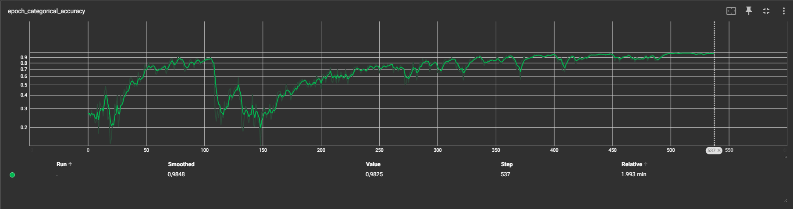
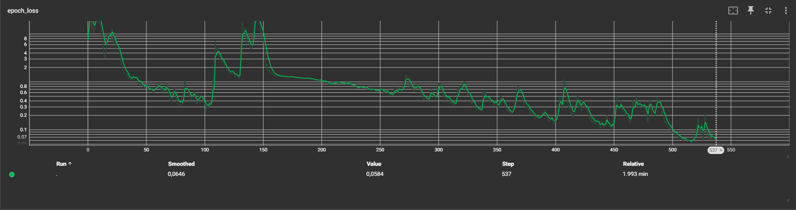
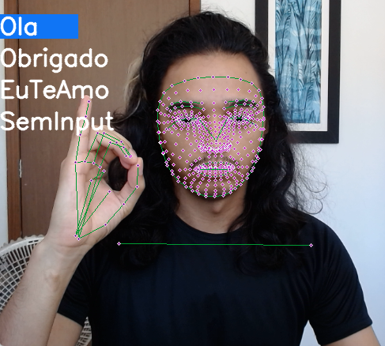
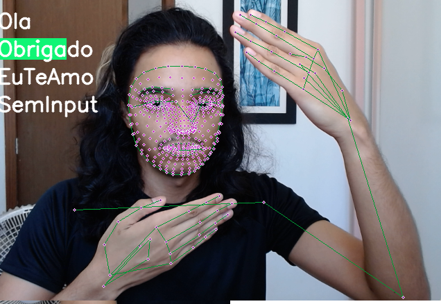
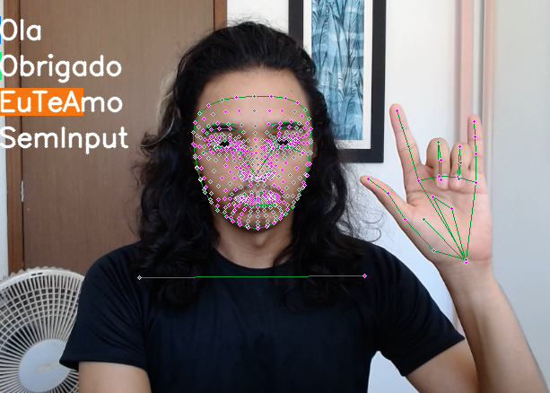
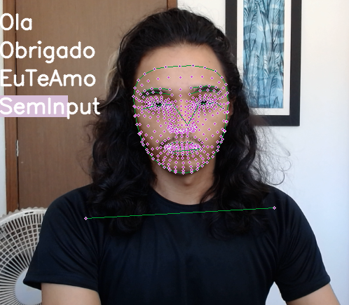

# Brazilian Sign Language Detection

Using Deep Learning to recognize gestures in LIBRAS (Língua Brasileira de Sinais).

## Project Overview

This project leverages deep learning techniques to detect and classify hand gestures used in Brazilian Sign Language (LIBRAS). The system processes video streams or images, identifies hand landmarks, and predicts the corresponding gesture using a trained neural network.

## Methodology

1. **Dependencies**: The project uses libraries such as TensorFlow, MediaPipe, OpenCV, and scikit-learn for model training and gesture recognition.
2. **Data Preparation**: A dataset of hand gestures is preprocessed and augmented to improve model robustness.
3. **Model Training**: A neural network is trained to classify gestures based on extracted features from hand landmarks.
4. **Real-Time Detection**: The system integrates with a webcam or video feed to perform real-time gesture recognition.

## Landmark Detection

Using MediaPipe and OpenCV, the system detects hand landmarks in real-time. These landmarks are essential for extracting features used in gesture classification.

*Example of detected hand landmarks using MediaPipe and OpenCV.*

## Gesture Capture

Captured gestures are saved as input data for model training. Each gesture is labeled and stored in a structured format, ensuring consistency and accuracy during training.

## Model Details

The model is built using a Sequential architecture, combining LSTM layers for temporal feature extraction and Dense layers for classification. The following configurations were used:

- **Optimizer**: Adam
- **Loss Function**: categorical_crossentropy
- **Metrics**: categorical_accuracy

This architecture ensures effective learning of temporal dependencies in the gesture data.

*Model summary showing total parameters, trainable parameters, and non-trainable parameters.*

### Training Progress

The model was trained for 537 epochs, achieving convergence in both categorical accuracy and loss reduction:

*Categorical accuracy over epochs.*

*Loss reduction over epochs.*

## Results

The model successfully detects and classifies gestures with high accuracy. Below are examples of the detection pipeline for different gestures:

| Gesture             | Example Image                                              |
|---------------------|-----------------------------------------------------------|
| **Oi/Olá**          |  |
| **Obrigado**        |  |
| **Eu te amo**       |  |
| **Sem Input**       |  |

Further optimization is ongoing to improve detection speed and accuracy in real-world scenarios.

## Future Work

- Expand the dataset to include more gestures and variations.
- Integrate the system into a mobile or web application for broader accessibility.
- Improve robustness to handle complex backgrounds and lighting conditions.
